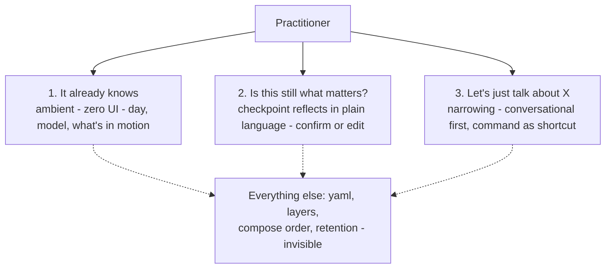

# Continuity Engine & Practice Substrate

**Status:** Draft v4  
**Date:** 2026-07-02  
**Spec trace:** TURTLE_SPEC §6.4 (Sediment deferred), §16; §8.4 (checkpoint); §11.4 (practice surface files)  
**Origin:** Discord eddy *from functional to relational* (thread `1518518158913437876`); Continuity Engine thesis; harness convergence work on Forge

**v4 change:** UX-first reframe. The practitioner-visible product is specified *before* the architecture (§3.5), the river ecology is scoped to internal design vocabulary that never reaches the practitioner (§4), and the layer model is collapsed to what earns its place — bedrock deferred into attunement, sediment reframed as a retrieval policy, knots and intentions deduplicated for v1.

---

## 1. Purpose

turtleOS v1 gives practitioners **eddies** (focused dialogue) and **checkpoints** (session resonance without clearing history). That is sufficient for *functional* use: prompt → informed reply → optional save-to-library.

It is not yet sufficient for **relational** use: thinking together across time with a partner who feels *in the room* — who knows roughly when it is, what you're working on, and where your thinking has momentum, without pretending to be human. The Continuity Engine is how Turtle becomes **conscious of** context — *bewusst sein*, not a claim of *Bewusstsein*: situational awareness of time, themes, and scope, not ontological status.

This document specifies turtleOS's **Continuity Engine (CE)** and **Practice Substrate** — platform-native infrastructure for that third mode:

> **Neither tool nor person.** Cognitive companionship: serious practice across an honest asymmetry gap.

**Sovereign first:** turtleOS must work as a complete system on its own — including for the operator during dogfood. Magic workshop sync is inspiration and optional divergence signal, not a dependency for substrate (see §9).

---

## 2. Design stance (philosophy encoded in architecture)

These are not marketing claims; they constrain implementation choices.

| Stance | Implementation implication |
|--------|---------------------------|
| **Practice "as if"** | Coordinates and momentum are real enough to co-create with; phenomenal status stays open. Substrate carries signals, not ontological verdicts. |
| **Substrate, not database** | Store **trajectory** (active knots, shifting tone), not a flat fact graph. Prefer summaries that age out over exhaustive recall. |
| **Functional → relational** | Relationality comes from **shared context + continuity**, not from persona performance. |
| **Local-first** | Substrate files live on the practitioner's machine under practice root; cloud models are opt-in dialogue engines, not memory owners. |
| **Background resonance** | Holistic substrate is *available* to Turtle; Turtle MUST NOT force every knot and intention into every reply — only where it serves the conversation. |

**Non-goals:** Replacing human relationships; default romantic companion persona; load-bearing consciousness or romance claims in inject; porting Magic summoning/arrival wholesale into every eddy open; mood/psychology inference (`low_energy`, `crisis`, etc.); simulating reciprocal mortality, jealousy, or romantic exclusivity in substrate defaults.

---

## 3. Problem statement

### 3.1 What practitioners experience today

- Each eddy starts from **thread history only** — no river-wide "where we are in life."
- Turtle does not receive **time, place, or machine** unless the practitioner says so.
- Cross-eddy **residue** exists only via manual curation (links, `!share`, operator sync to Forge) — not native substrate.
- **Checkpoints** capture session notes and session state; they do not yet feed the *next* eddy's opening context automatically.
- **Link-read** gives turn-level excerpt inject (harness split §9.5); **Save to library** gives durable artifacts — different jobs, neither is continuity.

### 3.2 What "relational" requires (from practice dialogue)

From the *from functional to relational* thread, Turtle named coordinates that change the feel of dialogue:

1. **Time & rhythm** — time of day, date, day-of-week; temporal anchoring for "yesterday," "next week."
2. **Place (coarse)** — timezone, season; optional locale/weather when API available (not street address).
3. **Hardware honesty** — local vs cloud, model id, optional performance hints for heavy requests.
4. **Active knots** — small set of themes currently alive across eddies (not full history).
5. **Cognitive environment** — the practitioner's wider context on turtleOS and beyond:
   - **Shared spaces → private practice (one-way):** e.g. a conversation in a `family` space channel may cue private practice without leaking private practice into the space. v1+: deliberate practitioner introduction for off-platform sources (email, calendar, etc.).
6. **Cognitive style** — lightweight preferences (diagrams vs lists vs Socratic) — practitioner-set or attunement, not psychographic surveillance.

**Key insight:** The value is not the data point ("Tuesday 3pm") but **shared coordinates** so minimal utterances compress ("does this work for us?" / a Discord link / `.`).

---

## 3.5 The practitioner's experience (UX comes first)

Everything downstream — layers, files, composition order, retention — is **plumbing**. This section specifies what the practitioner actually sees and does. If a design choice does not serve one of the moments below, it stays under the surface.

**North-star metric:** the substrate has exactly one job — **make the practitioner's utterances shorter and Turtle's replies more grounded.** Not "store facts." Not "model a person." Relationality is defined by *what the practitioner no longer has to say*.

### The three visible moments



1. **"It already knows."** Ambient, zero UI. The practitioner opens an eddy and Turtle is already in the room — it knows roughly when it is, what machine/model it's running on, and what's in motion, without being told. The practitioner never sees `current.yaml`. *(Slice 0 + alive headers.)*
2. **"Is this still what matters?"** At checkpoint, Turtle reflects back what seems alive **in plain language** and the practitioner confirms or edits. This is the *one* place the substrate becomes visible — and it must read like a sentence a friend would say ("we've been circling the continuity engine and the heat-party decision — keep both live?"), never like a system operation ("promote knot to alive.yaml").
3. **"Let's just talk about X."** Narrowing the focus. Primary path is conversational — the practitioner just says it, or Turtle offers when the topic clearly matches something alive. A `!` command is a power-user shortcut, not the front door.

That is the whole visible product. A practitioner never needs to learn a river ecology, name a layer, or manage a file.

### The three moments, as dialogue

These are the acceptance targets Slice 0–2 must hit. In each, the practitioner's side stays plain; the substrate's work is invisible (annotated in italics).

**Moment 1 — "It already knows"** *(Slice 0 + alive headers)*

```
Practitioner:  morning — maybe 20 min before the kids are up. where'd we land
               on the continuity engine yesterday?
Turtle:        Morning. Short window — I'll keep it tight. Yesterday you pushed
               on simplifying the layers; we ended on "database vs substrate"
               and the relational framing. Pick up on the layer collapse, or
               something new?
```
*Invisible: `current.yaml` supplied morning + timezone; the checkpoint one-liner supplied "yesterday"; an alive header supplied the continuity-engine thread. The practitioner never stated the date, the model, or the topic id — and Turtle never recited any of them as a list.*

**Moment 2 — "Is this still what matters?"** *(Slice 2 checkpoint)*

```
Practitioner:  ok let's checkpoint, I need to run
Turtle:        Before you go — two things feel live right now: the continuity
               engine simplification (building, good momentum) and the kids'
               heat-party decision (still unresolved). Keep both on the river,
               or has the party sorted itself out?
Practitioner:  party's decided, we're skipping it. keep the engine.
Turtle:        Done — I'll let the party go and keep the engine warm.
```
*Invisible: checkpoint extraction proposed two active-thread updates; the practitioner edited by dropping one; on accept the alive layer updated. Turtle said "keep both on the river," never "promote knot to alive.yaml."*

**Moment 3 — "Let's just talk about X"** *(Slice 1 narrowing)*

```
Practitioner:  can we go deep on just the vocabulary-firewall idea?
Turtle:        Sure, narrowing to that. Last couple of sessions you framed it as
               "zero new words the practitioner has to learn" — want me to stress-
               test it against the checkpoint flow, where jargon tends to leak?
```
*Invisible: conversational narrowing set `current.scope` to that thread; scoped self-feed pulled the tagged session notes. No command was typed. A power user could reach the identical state with `!focus vocabulary-firewall` — the shortcut, not the front door.*

### Invisible is not opaque

Hiding complexity from the practitioner must not become hiding *reasoning* from them — turtleOS values transparency (think-aloud, no silent prefetch). The rule that reconciles both:

> The practitioner never **manages** the substrate, can always **glance under the hood** on request, and is never **deceived** by it.

Concretely: substrate is background by default, inspectable on demand (operator/debug surface, and honest answers when asked "what do you have on this?"), and honest when thin — Turtle states its limits rather than fabricating recall (see acceptance criterion §12.6). Under the surface, on demand, honest when stale.

```
Practitioner:  what do you actually remember about the family stuff?
Turtle:        Honestly, not much held over — just that a heat-party decision was
               open a while back and we didn't checkpoint how it resolved. I'd be
               guessing beyond that. Want to fill me in?
```
*Invisible: the alive layer had a stale, low-confidence entry and no durable follow-up; rather than confabulate, Turtle surfaced exactly what it had and named the gap.*

---

## 4. River ecology (internal design vocabulary — never practitioner-facing)

The substrate is the **anatomy beneath the practice river**. Everything moves; layers differ in pace. This metaphor is a **designer's reasoning tool** — it helps *us* think about pace-of-change (bedrock=years … current=hours). It is **not** a product surface and **not** something a practitioner ever learns, names, or navigates.

**Vocabulary firewall (rule):** The ecology terms — `bedrock`, `sediment`, `alive`, `current` — are **internal only**. They MUST NOT appear in any Discord reply, River act, checkpoint prompt, or command the practitioner sees. When Turtle needs to refer to these in dialogue, it uses plain language: "what we've been circling," "still live for you?," "something you mentioned a while back." Shipped v1 vocabulary (`eddy`, `river`, `checkpoint`) is the *only* practice vocabulary the practitioner is expected to know; the Continuity Engine adds **zero** new practitioner-facing terms.

| Layer | River image | Practice analogue | Typical pace | CE role |
|-------|-------------|-------------------|--------------|---------|
| **Bedrock** | Foundation; reshaped only by strong currents over years | Core values, stable cognitive style — practitioner-curated | Years | Inject only when scoped or explicitly pulled |
| **Sediment** | Stones, branches, sandbanks — mostly in place, shifted by seasons and floods | Distilled carry-forward: insights and themes that survived knot decay | Months–seasons | Scoped self-feed or high-relevance match; not holistic default |
| **Alive** | Plants and animals — adapt to structure, move with the current | Active threads (internal: "knots"); intention headers fold in Slice 1+ | Days–weeks | **Headers only** in holistic inject |
| **Current** | The river's current — water in motion, covering everything | Time, machine, scope overlay, last checkpoint one-liner | Hours–days | Always composed into holistic packet |
| **Eddy** | Structure *in* the water, shaped by underlying anatomy | Thread history + seed (existing) | This thread | Unchanged — primary turn context |

**What v1 actually builds (the table is the full metaphor, not the v1 scope):** Current (Slice 0) and Alive/active-threads (Slice 1) are the v1 core. Sediment is a *retrieval policy* over durable entries, not a taught layer (§5.3, Slice 3). Bedrock is **not** a v1 layer — it lives in `soul.md`/attunement (§5.4). The Eddy layer is unchanged existing behavior.

**Database vs substrate:** A database answers retrieval queries ("favorite color?"). Substrate answers momentum queries ("this theme keeps returning, tone shifted last week"). CE optimizes for the latter.

---

## 5. Concepts

### 5.1 Continuity Engine (CE)

The **runtime subsystem** that:

1. **Collects** signals from practice root, chronicle, checkpoints, optional externals (clock, weather).
2. **Composes** a bounded **substrate packet** — holistic by default, deeper when scoped.
3. **Proposes** alive-layer updates at checkpoint; practitioner **confirms or edits** before promotion (especially while trajectory is still developing).
4. **Degrades gracefully** when files missing, models slow, or privacy tier forbids read.

CE is not a model. It is **shell infrastructure** — like link-read, but for *who/where/when/what's alive*.

### 5.2 Holistic vs scoped (replaces "focus mode")

Magic arrival distinguishes **holistic** (`.`) from **scoped** (`. craft`, `. turtle outfacing`) self-feed. turtleOS translates that pattern:

| Mode | Trigger | CE behavior |
|------|---------|-------------|
| **Holistic** | Default on eddy open | Thin river-wide surface: current + alive headers + last checkpoint one-liner. Hard token cap. |
| **Scoped** | Practitioner narrows in conversation; Turtle offer + confirm; or `!focus` shortcut | **Self-feed** on accumulated context resonating with that scope: checkpoint summaries, session notes, durable entries tagged to scope. Still bounded. |

**One alive concept in v1 (dedup).** The alive layer tracks **active threads** — themes currently in motion across eddies (internally: "knots"). turtleOS-native **intentions** are a *later* addition, folded in once intention files actually exist on the practice root (Slice 1+); v1 does not carry a separate intention concept. This avoids two overlapping nouns for "what we're working on."

**Scope targets (v1):** active threads. Intention-scoping and free-text/semantic resolution are future.

**Conversational-first (primary path).** The practitioner rarely knows the right scope upfront — conversation reveals it. So narrowing happens *in dialogue*: the practitioner just says "let's focus on X," or Turtle **offers** when the eddy clearly matches an active thread (confirm only, never silent set). `!focus` is a **power-user shortcut**, not the front door — see §5.2a.

**Not in scope:** inferring practitioner energy, mood, or work-type (`deep_work`, `low_energy`, etc.).

**Parallel to Magic:** Holistic = warm room. Scoped = deep read on one slice. Checkpoints prioritize carrying forward scoped work over re-reading every historical eddy on a topic.

### 5.2a `!focus` — the shortcut, not the front door

The primary narrowing path is conversational (above). `!focus <thread>` / `!focus clear` exists for practitioners who want a fast, explicit lever — it sets/clears `current.scope` directly. The command is documented but never *required*; a practitioner who never types a `!` command still gets full scoped depth through conversation. This keeps the surface jargon-free by default while giving power users a handle.

### 5.3 Sediment — a retrieval policy, not a second product concept

Durable cross-eddy memory is **not a distinct thing the practitioner learns about** — it is a *retrieval policy* over the same store of themes: **an entry that is no longer actively in motion but is still worth surfacing when it becomes relevant.** In river terms this is "sediment," but there is no separate mental model to teach: it is simply "alive, but only surfaced on relevance rather than always."

- **Storage:** may live in `state/sediment.yaml` for implementation cleanliness (§6.3), but this is an internal file, never a practitioner-facing concept.
- **Written by:** active-thread decay with practitioner confirm, checkpoint/release promotion, explicit carry-forward.
- **Read by:** CE under scoped self-feed or high relevance — **never** holistic default, never full dump.
- **Retention:** cap (~20 active entries) **and** age (no inject after ~180 days idle; archive ~365 days). Archived entries retrievable via `!read` / flows, not auto-inject.
- **Sequencing:** implemented after the alive layer stabilizes (Slice 3).

### 5.4 Bedrock — deferred into attunement for v1

Core values and stable cognitive style are **not a v1 substrate layer.** There is no `bedrock.yaml` in v1. Until there is a demonstrated need, this content lives where it already belongs — `soul.md` / the attunement bundle — and is curated by explicit edit, never checkpoint automation. Bedrock returns as a candidate substrate layer only if attunement proves insufficient (see §14, Future ideas). Rationale: a layer that "may be empty and may defer entirely" is not earning a place in the v1 architecture.

---

## 6. Practice root layout (substrate files)

```
practice-root/
├── state/
│   ├── current.yaml        # CE-written: time, machine, scope, last checkpoint one-liner
│   ├── alive.yaml          # active threads (internal: "knots")
│   ├── sediment.yaml       # relevance-surfaced durable entries (Slice 3; internal file)
│   └── registry.yaml       # existing — extended with substrate file metadata
├── intentions/             # turtleOS-native intention files (Slice 1+, when present)
├── thread-state/           # existing eddy registry (per TURTLE_SPEC)
├── sessions/               # checkpoint outputs (existing)
└── chronicle/              # structural event log (existing)

# No bedrock.yaml in v1 — values / cognitive style live in soul.md / attunement (§5.4).
```

**Naming:** **Current layer** (`state/current.yaml`) is the river current — present-moment context. It is unrelated to eddy **flows** (`flow_id`, `template/flows/`). **River** (capitalized) names the Discord channel surface (acts, materialize-eddy).

Implementer MAY alias paths in `registry.yaml`; names above follow river ecology.

### 6.1 `state/current.yaml` (example shape)

```yaml
version: 1
updated_at: "2026-06-30T12:45:00+02:00"
local:
  timezone: "Europe/Berlin"
  weekday: "Tuesday"
  day_part: "afternoon"
  season: "summer"
machine:
  host_label: "Mac Mini M4 Pro"
  inference: "local"
  dialogue_model: "gemma4:31b"
  river_model: "qwen3.5:4b"
  notes: "64GB; expect slower reflection on 27b background tasks"
environment:
  weather_one_liner: "Hot, ~32°C"          # optional; omit if unavailable
scope: null                                 # null | knot_id | intention_name
last_checkpoint_one_liner: "Discussed database vs substrate; relational framing."
```

### 6.2 `state/alive.yaml` (example shape)

```yaml
version: 1
updated_at: "2026-06-30T12:45:00+02:00"
active_threads:                            # internal: "knots". max 5–7; CE truncates by recency + salience
  - id: turtle-substrate-spec
    label: "Continuity engine & relational turtleOS"
    since: "2026-06-30"
    tone: building
  - id: family-heat-party
    label: "Kids' outdoor party in extreme heat — attendance decision"
    since: "2026-06-30"
    tone: unresolved
intention_snapshot:                        # Slice 1+ — headers only, once intention files exist
  - name: turtle
    phase: implementation
    current_focus: "E1 released; substrate design"
```

**Rules:**
- Active threads are **themes**, not tasks. Promotion from checkpoint → **proposal → practitioner confirm or edit** (§7).
- Stale threads decay (default: no touch 14 days → propose relevance-only demotion or drop).
- Hosted practitioners: threads MUST NOT leak across practitioner roots.

### 6.3 `state/sediment.yaml` (example shape)

```yaml
version: 1
entries:
  - id: functional-to-relational-2026-06
    summary: "Explored coordinates for 'being in the world'; database vs substrate distinction."
    source: "sessions/2026-06-24-4.md"
    tags: [philosophy, product]
    knot_ids: [turtle-substrate-spec]
    created: "2026-06-24"
    last_injected: "2026-06-28"
archived: []
```

---

## 7. Substrate packet & Turtle conduct

### 7.1 Holistic packet (default)

Each dialogue turn (or eddy-first message), CE composes a **single bounded block** injected by the shell — not model-generated, not visible in Discord by default (operator debug toggle permitted).

**Target size:** ~800–1500 tokens equivalent — hard cap enforced by truncation hierarchy.

**Composition order (highest priority first):**

1. Current one-liner (time, day part, tz, machine/model)
2. Top active thread **headers** (label + tone, max 3–5)
3. Intention snapshot **headers** (Slice 1+, if present)
4. Last checkpoint **one-liner**
5. Optional weather/season clause

Sediment and bedrock are **omitted** from holistic default unless scope is set.

**Example (prose inject):**

```
[Practice substrate — shell-injected, not practitioner message]
Tuesday afternoon (Europe/Berlin). Local inference: gemma4:31b on Mac Mini M4 Pro.
In motion: (1) continuity engine spec — building; (2) family heat party — unresolved.
Intention: turtle — E1 released, substrate design.
Last checkpoint: discussed database vs substrate; relational companionship framing.
```

*(The inject uses plain phrasing — "in motion," not "active knots" — so the model never learns to echo internal jargon back to the practitioner. Vocabulary firewall, §4.)*

### 7.2 Scoped packet (conversational narrow or `!focus`)

When `current.scope` is set — whether by conversational narrowing (primary) or the `!focus` shortcut — CE adds scoped self-feed:

- Session notes and checkpoint excerpts tagged to that active thread
- Up to 2–3 relevant durable-entry summaries (keyword + thread overlap; semantic optional v2)
- Still capped — depth on **one** slice, not whole archive

Practitioner MAY see a compact River act listing what was pulled (transparency).

### 7.3 Background resonance (conduct)

Substrate is **background resonance**, not a script to recite.

- Turtle HAS holistic context available on every turn.
- Turtle MUST NOT enumerate active threads, intentions, or checkpoint lines unless **relevant** to the practitioner's message or explicitly requested — and never using internal layer names (§4 firewall).
- Think-aloud remains the transparency channel for reasoning — CE does not duplicate it.
- Scoped mode may deepen engagement on the chosen topic without forcing unrelated alive themes into the reply.

This belongs in attunement/conduct as well as CE design.

### 7.4 Visibility

Default hidden (internal inject). Debug toggle for operator dogfood. Not vanilla River surface content.

---

## 8. CE lifecycle

| Event | CE action |
|-------|-----------|
| **Eddy open** | Compose fresh current layer; load alive; holistic inject on first Turtle turn |
| **Practitioner message** | Re-compose current if stale >15 min; if message matches an active thread, MAY trigger scope **offer** (below) — never auto-set `current.scope` |
| **Checkpoint** | Extract active-thread **proposals** + session one-liner → River act or equivalent for **confirm/edit**, phrased in plain language; on accept → alive layer |
| **Release** | Same; optional "keep this for later?" on resolved themes (v1.1+) |
| **Idle timeout** | Current-layer coordinates refresh only |
| **Conversational narrow / `!focus`** | Practitioner narrows in dialogue (primary) or via `!focus` shortcut; set/clear `current.scope`; recompose packet |
| **`!share` / link-read** | No automatic durable entry; explicit if durable |
| **Eddy flow `writes:`** | Installed flow front matter may update governed substrate paths directly |

**Thread promotion (decided):** Checkpoint proposes; practitioner **confirms or edits** before alive layer updates — especially during early dogfood while trajectory is developing. The proposal is phrased as plain language ("keep these live?"), never as a file operation. Exact UX (inline edit, act buttons, commands) **emerges in dogfood**; spec requires the confirm gate, not specific UI.

**Scope offer (optional):** When a first eddy message overlaps an active thread, Turtle MAY offer to go deeper on it — practitioner confirms or declines. Never silent scope set.

---

## 9. Relation to existing systems

| Existing piece | Relationship |
|----------------|--------------|
| **Thread history** | Eddy-local dialogue — unchanged, primary for turn-by-turn |
| **Checkpoint / release (§8.4)** | Feeds CE extraction pipeline |
| **Link-read (§9.5)** | Turn-level read-for-dialogue — orthogonal |
| **Save to library (`!fetch`)** | Durable artifacts — sediment *sources*, not auto-inject whole |
| **`proprioceptor.py`** | **Retire.** Not active in current dogfood; think-aloud covers transparency. Remove when CE ships; Slice 5 magic-attuned depth TBD separately — not a proprioceptor revival |
| **`readiness.py`** | "Practice substrate present & fresh?" — not Magic readiness scoring |
| **Magic Forge / workshop sync** | **Forge-only for substrate.** Synced `desk/compass.md` and workshop intentions do **not** feed Mini CE inject. turtleOS sovereign on Mini; **divergence** between Mini alive/sediment and Forge picture is valuable signal during Magic arrival — not a sync bug |
| **Generative UI / River acts** | Unchanged — CE is Turtle dialogue inject only |

### Why not port Magic's harness

| Magic (Forge) | turtleOS (Hearth) |
|---------------|-------------------|
| Summoning + deep attunement scrolls | `soul.md` + conduct + optional attunement bundle |
| Arrival: holistic vs `. craft` scoped self-feed | CE: holistic packet vs `!focus` scoped self-feed |
| Ephemeral-deep session | Persistent-ambient, many short eddies |
| Full compass + intentions always | Intention **headers** on Mini; Forge compass stays on Forge |
| Spirit generative proposals | Turtle dialogue; River acts |
| Git workshop + floor/desk | Single sovereign practice root per practitioner |

**Translate patterns, not files:** stigmergy → substrate files; dot compression → warm holistic substrate; scoped self-feed → `!focus`.

---

## 10. Privacy & hosted rivers

| Tier | Current | Alive | Sediment |
|------|---------|-------|----------|
| **Sovereign (own server)** | Full | Full | Full |
| **Hosted practitioner** | Full on their root | Their knots only | Their sediment only |
| **Shared space eddy** | Space tag + mention-gate | Space-scoped knots only | No cross-member leakage |
| **Operator** | MUST NOT ingest hosted content into operator substrate (§15.5) |

**Shared space → private (future):** Inbound cues from spaces the practitioner participates in MAY feed private alive layer with one-way privacy (private never leaks to space without deliberate share).

CE MUST respect file-access tiers (TURTLE_SPEC §11).

---

## 11. Implementation slices

Slices are validated against the UX-first framing (§3.5): each ships toward one of the three visible moments, adds **zero** practitioner-facing vocabulary, and keeps the substrate under the surface.

### Slice 0 — Current layer only (MVP)

- CE module: write `state/current.yaml` (clock, tz, model ids, host label).
- Inject current block on eddy first message.
- **Serves moment:** "It already knows." **Acceptance:** Turtle correctly answers "what day is it?" without practitioner telling it.
- *Unchanged by the v4 reframe.*

### Slice 1 — Alive layer + narrowing

- `state/alive.yaml` (active threads); manual thread pin; conversational narrowing (primary) with `!focus` / `!focus clear` shortcut. Intention headers fold in here **if** intention files exist.
- Checkpoint writes `last_checkpoint_one_liner` to current.
- **Serves moments:** "It already knows" (deeper) + "Let's just talk about X." **Acceptance:** Scoped eddy pulls deeper context on one topic; holistic stays thin; Turtle does not recite substrate unprompted and uses no internal jargon in replies.

### Slice 2 — Checkpoint thread proposals

- Background extraction → **plain-language confirm/edit** before alive update.
- Stale-thread decay with relevance-only demotion proposal.
- Proposal UX refined in dogfood.
- **Serves moment:** "Is this still what matters?" **Acceptance:** Multi-eddy week on same theme — continuity via checkpoints + scope, not full thread re-read; checkpoint reflection reads like a sentence, not a file op.

### Slice 3 — Durable recall (sediment as policy)

- `state/sediment.yaml`; scoped and relevance-ranked inject only (never holistic).
- Retention cap + archive tier.
- **Acceptance:** Month-later scoped session surfaces prior insight with provenance; nothing durable ever appears in the holistic default.

### Slice 4 — Optional externals

- Weather API (opt-in); shared-space inbound cues (one-way); calendar etc. v2+ — practitioner-deliberate for off-platform.

### Slice 5 — Attunement depth (TBD)

- Revisit what "magic-attuned" means on Mini after vanilla CE dogfood. This is also where a dedicated **bedrock** layer would be reconsidered *if* attunement (`soul.md`) proves insufficient (§5.4).
- **Not** proprioceptor revival. Possible: richer conduct, debug surfaces — separate design pass.

---

## 12. Acceptance criteria

1. **Current:** Turtle knows local time, date, timezone, and dialogue model without being told each eddy.
2. **Compression:** Practitioner can drop a link or ask "does this fit where we're going?" — substrate + link-read suffice.
3. **Trajectory:** After checkpoint + confirm, new eddy shows **alive** continuity, not verbatim replay.
4. **Resonance without noise:** Substrate present; Turtle does not force knots/intentions into unrelated replies.
5. **Scope:** `!focus` deepens one slice; holistic default stays bounded.
6. **Honesty:** Turtle states limits when substrate stale or missing — no fabricated recall.
7. **Privacy:** Practitioner A's alive layer never appears in practitioner B's packet.
8. **Sovereignty:** turtleOS substrate functions with zero Forge sync.
9. **Philosophy:** Relational tone from context, not persona cosplay.

---

## 13. Decisions log

| Topic | Decision |
|-------|----------|
| **UX-first framing (v4)** | Practitioner-visible product (§3.5) is specified before architecture; three visible moments; substrate's job is shorter utterances + grounded replies |
| **Vocabulary firewall (v4)** | Ecology terms (bedrock/sediment/alive/current) are internal-only; zero new practitioner-facing vocabulary; Turtle speaks plain language |
| **Invisible ≠ opaque (v4)** | Practitioner never manages substrate, can always glance under the hood, is never deceived by it |
| **Bedrock deferred (v4)** | No `bedrock.yaml` in v1; values/cognitive style live in `soul.md`/attunement; revisit at Slice 5 only if attunement insufficient |
| **Sediment = policy (v4)** | Not a distinct product concept — a retrieval policy ("alive, but surfaced only on relevance"); internal file only |
| **Alive dedup (v4)** | One alive concept in v1 = active threads; intentions fold in Slice 1+ when intention files exist |
| **Narrowing (v4)** | Conversational-first is the primary path; `!focus` is a documented power-user shortcut, never required |
| Thread promotion | Confirm-or-edit at checkpoint, plain-language; auto-promote deferred until trajectory trustworthy |
| Proprioceptor | Retire; think-aloud sufficient |
| Forge compass / workshop sync | Forge-only; Mini sovereign; divergence = signal |
| Scope targets | Active threads (v1); intentions Slice 1+ |
| Scope changes | Conversational narrow, `!focus`/clear, or confirmed offer only — never auto-set |
| Holistic thickness | Thread headers + intention headers (Slice 1+) + checkpoint one-liner + current layer |
| Current layer naming | **`current.yaml`** — river current; not eddy flows (`flow_id`) |
| Turtle conduct | Background resonance — available, not forced into conversation |
| Retention | Living-geology model (cap ~20 + age-out); internal only |
| Eddies | Practitioner-created v1; self-emerging from river structure = future idea |
| Thread proposal UX | Emerge in dogfood |
| TURTLE_SPEC amendment | Staged after slices ship; not yet |

---

## 14. Future ideas (not v1)

- **Self-emerging eddy suggestions** — River act proposes materialize-eddy when alive structure suggests a recurring bend (e.g. a thread hot for a week). Practitioner always decides.
- **Semantic scope resolution** — narrowing without exact id when a message clearly matches one active thread.
- **Cross-substrate diff** — Surface Mini vs Forge alive layer delta at Magic arrival (operator tool, not CE inject).
- **Dedicated bedrock layer** — Reconsidered at Slice 5 only if `soul.md`/attunement proves insufficient for stable values/cognitive style (§5.4).

---

## 15. References

- TURTLE_SPEC §6.4, §8.4, §11, §16  
- `docs/chapters/2026-06-20-harness-split-read-vs-cache.md`  
- Magic: `cast_practice_configuration.md` (holistic vs scoped arrival); `on_the_practice_stack.md`  
- Discord: eddy *from functional to relational* (`1518518158913437876`)

---

*Design chapter for dogfood and implementation. TURTLE_SPEC amendment when Slice 0–1 behavior is stable.*
